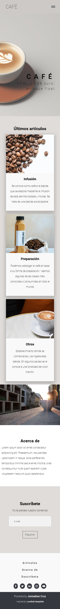
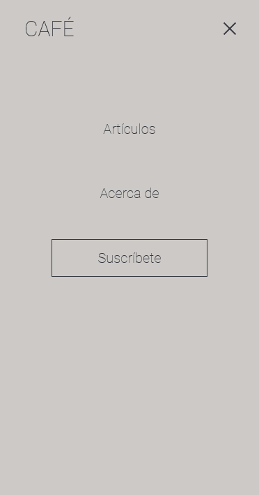
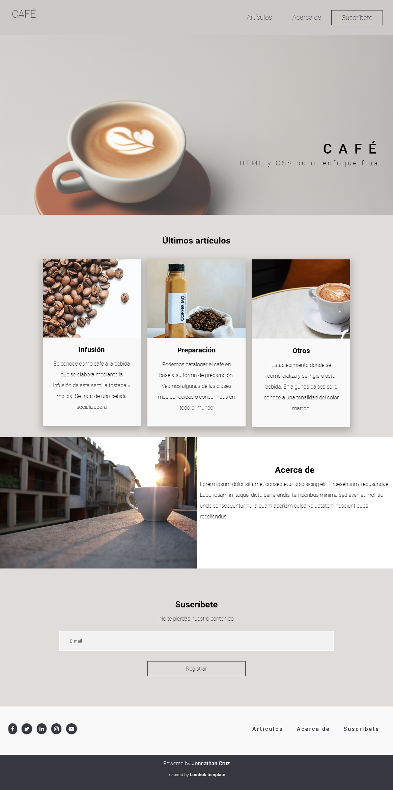
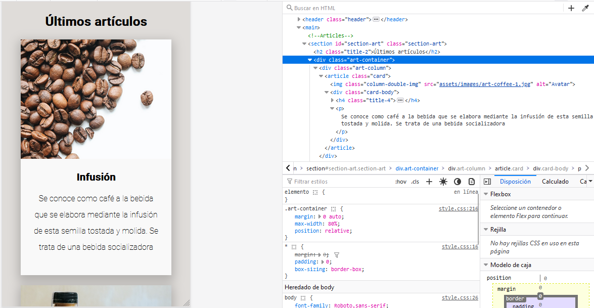

# Coffee. Css Positioned

## Descripción

Estudio personal en HTML y hojas de estilo CSS. Busco convertir la investigación en landing pages de sitios ficticios inpirados en el moodboard 'Dev' en mi [ Pinterest](https://pin.it/5y19mMg), el cual alimento y refresco contínuamente. En esta ocasión la exploración corresponde al layout Positioned, tan solo ubicando los elementos de la manera más básica provista por CSS.

Aquí puedes explorar la [Demo funcional](https://jonnathan-cruz.000webhostapp.com/portfolio/Coffee-CssPositioned/index.html).

Y aquí puedes ver [todo mi portafolio!!!](https://jonnathan-cruz.000webhostapp.com) -> Ready to Roll Out! 

## Instalación

Solo descargar y navegar al index.html de la raíz (no requiere apache).

## Screenshots

### Mobile:

### Desktop:

## Pruebas

Explora los estilos css en herramientas para desarrollador del navegador para visualizar la distribución de contenedores flex.

## Créditos

### Tutoriales:

- https://www.w3schools.com/css/

### Inspiración principal:
https://images.creativemarket.com/0.1.0/ps/4835945/580/1056/m1/fpnw/wm0/lombok-responsive-website-template-by-delightful-artifacts-.png?1&s=cf4666450320a0b0ae08c358b03e4d55

### Assets:

- Imagen de <a href="https://pixabay.com/es/users/inanimalis-4325847/?utm_source=link-attribution&utm_medium=referral&utm_campaign=image&utm_content=2246468">Cris</a> en <a href="https://pixabay.com/es//?utm_source=link-attribution&utm_medium=referral&utm_campaign=image&utm_content=2246468">Pixabay</a>

- Imagen de <a href="https://www.pexels.com/@brixton/">Brix Saranza</a> en <a href="https://www.pexels.com/photo/energizing-cold-coffee-in-plastic-bottle-near-beans-4621672/">Pexels</a> 

- Imágenes generadas por IA en <a href="https://app.leonardo.ai/">Leonardo.ai</a>

## Licencia

Este código se distribuye bajo licencia GPLv3.

